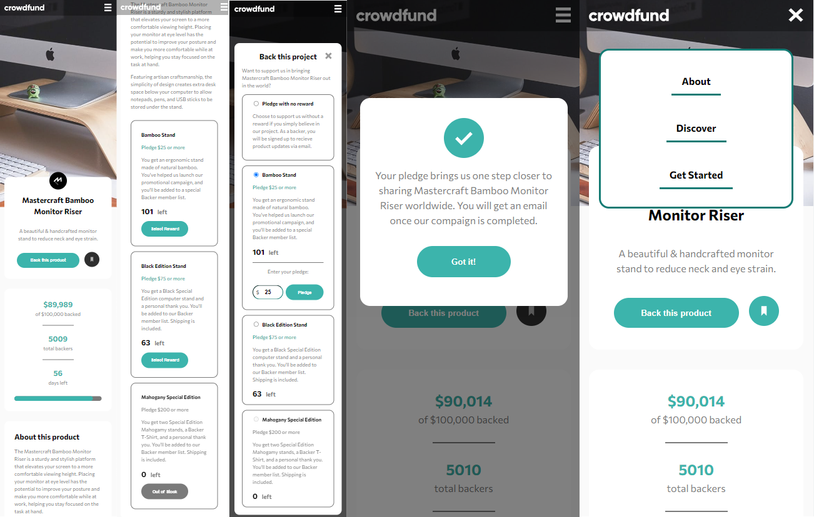
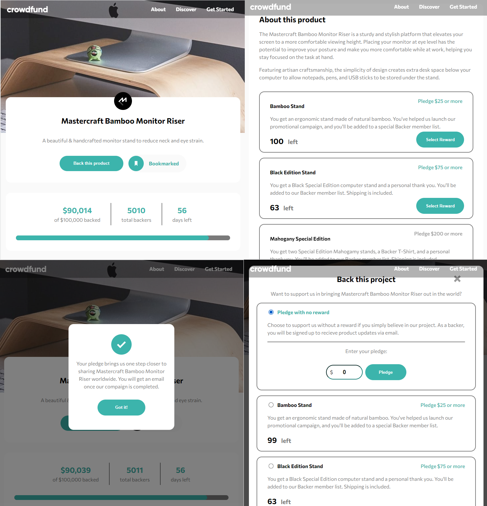

# Frontend Mentor - Crowdfunding product page solution

This is a solution to the [Crowdfunding product page challenge on Frontend Mentor](https://www.frontendmentor.io/challenges/crowdfunding-product-page-7uvcZe7ZR). Frontend Mentor challenges help you improve your coding skills by building realistic projects.

## Table of contents

- [Overview](#overview)
  - [The challenge](#the-challenge)
  - [Screenshot](#screenshot)
  - [Links](#links)
- [My process](#my-process)
  - [Built with](#built-with)
  - [What I learned](#what-i-learned)
- [Author](#author)

**Note: Delete this note and update the table of contents based on what sections you keep.**

## Overview

### The challenge

Users should be able to:

- View the optimal layout depending on their device's screen size
- See hover states for interactive elements
- Make a selection of which pledge to make
- See an updated progress bar and total money raised based on their pledge total after confirming a pledge
- See the number of total backers increment by one after confirming a pledge
- Toggle whether or not the product is bookmarked

### Screenshot

### Links

- Solution URL: [https://github.com/Helbindi/Crowdfund-Product]()
- Live Site URL: [https://helbindi-crowdfunding-page.vercel.app/]()

## My process

### Built with

- [React](https://reactjs.org/) - JS library

### What I learned

Major learnings for this project included building multiple components, responsive design styling for mobile and desktop, and management of React State logic.

Possible improvements:

- Less prop drilling, use Context and Reducer hooks instead.
- Better CSS management or utilize a CSS Preprocessor.

## Author

- Website - [https://my-projects-site.vercel.app/]()
- Frontend Mentor - [@Helbindi](https://www.frontendmentor.io/profile/Helbind)
